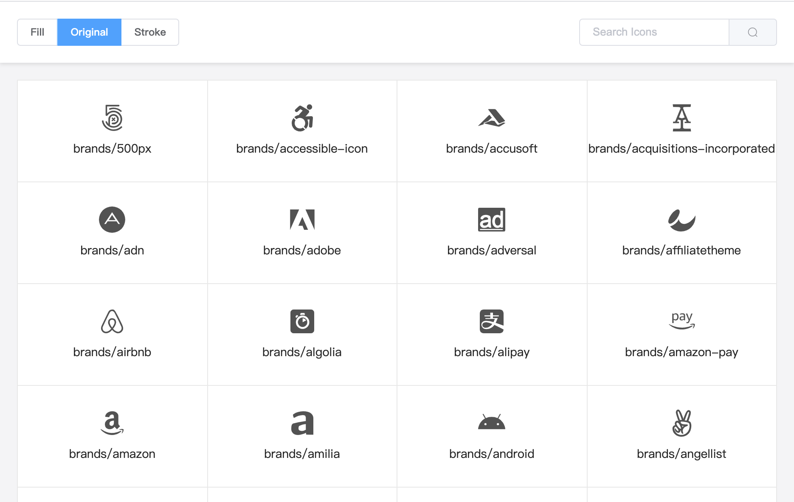
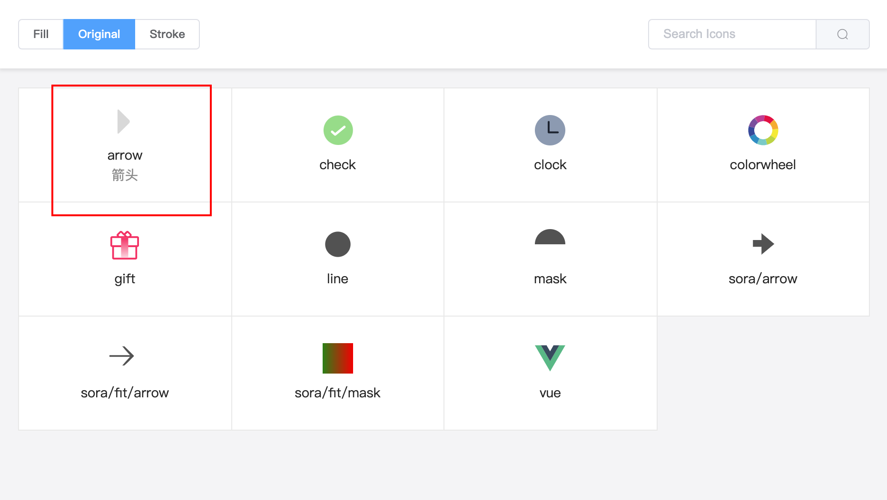

---
toc
---
# Advanced

## Component
### Color

<demo-color title="Single color (default: inherit font color)" />
::: details View Code
<<<@/docs/.vuepress/components/DemoColor.vue#demo
:::

<demo-reverse-color title="r-color (Reverse fill or stroke attributes)" />

> Clock icon: the circle is the fill, the hour and minute hands are the stroke, Vue icon: the first path is the stroke, the second is the path is the fill

::: details View Code
<<<@/docs/.vuepress/components/DemoReverseColor.vue#demo
:::

<demo-multi-color title="Multicolor (set in the order of path/shape)" />
::: details View Code
<<<@/docs/.vuepress/components/DemoMultiColor.vue#demo
:::

<demo-original-color title="Original Color (original)" />
::: details View Code
<<<@/docs/.vuepress/components/DemoOriginalColor.vue#demo
:::

> The second and third color wheels modify certain colors based on the primary colors

<demo-gradient title="Gradient" />
::: details View Code
<<<@/docs/.vuepress/components/DemoGradient.vue#demo
:::

### Size
<demo-size title="size, default unit: px, default size: 16px" />
::: details View Code
<<<@/docs/.vuepress/components/DemoSize.vue#demo
:::

### Fill/Stroke
<demo-fill title="fill, default: true" />
::: details View Code
<<<@/docs/.vuepress/components/DemoFill.vue#demo
<<<@/docs/.vuepress/components/DemoFill.vue#css
:::

### Direction
<demo-direction title="dir, default: up" />
::: details View Code
<<<@/docs/.vuepress/components/DemoDirection.vue#demo
:::

## Icon preview
Use `@yzfe/svgicon-viewer` to preview SVG files in any folder.

#### Installation
```bash
# Global installation
yarn global add @yzfe/svgion-viewer
```

#### Usage
```bash
# svgicon-viewer <svgFilePath> [metaFile]
svgicon-viewer ./src/assets/svg
```



Use meta.json to add additional information. Currently, only one name field is supported, which can be used to describe the icon.

```json
// meta.json demo
{
    "arrow": {
        "name": "箭头"
    }
}
```

```bash
svgicon-viewer ./src/assets/svg ./src/assets/svg/meta.json
```


