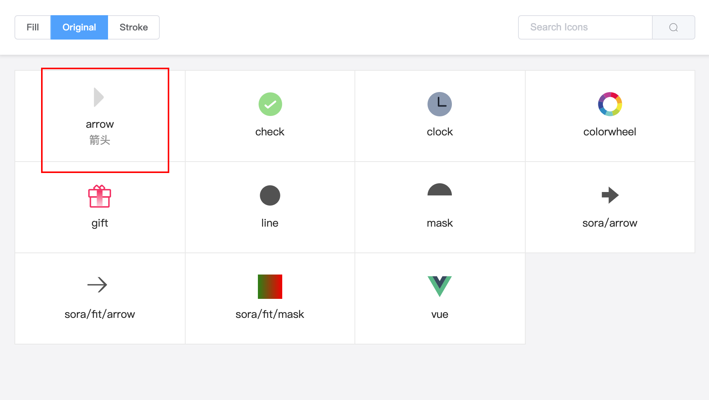

---
toc
---
# 深入

## 组件功能
### 颜色

<demo-color title="单色 (默认: 继承字体颜色)" />
::: details 查看代码
<<<@/docs/.vuepress/components/DemoColor.vue#demo
:::

<demo-reverse-color title="r-color (反转填充或描边属性)" />

> 时钟图标：圆形是填充，时针分针是描边， Vue 图标：第一个 path 是描边，第二个是 path 是填充

::: details 查看代码
<<<@/docs/.vuepress/components/DemoReverseColor.vue#demo
:::

<demo-multi-color title="多色（按照 path/shape 的顺序设置）" />
::: details 查看代码
<<<@/docs/.vuepress/components/DemoMultiColor.vue#demo
:::

<demo-original-color title="原色 (original)" />
::: details 查看代码
<<<@/docs/.vuepress/components/DemoOriginalColor.vue#demo
:::

> 第二和第三个色轮是在原色的基础上修改某些颜色

<demo-gradient title="渐变" />
::: details 查看代码
<<<@/docs/.vuepress/components/DemoGradient.vue#demo
:::

### 大小
<demo-size title="size, 默认单位：px, 默认大小：16px" />
::: details 查看代码
<<<@/docs/.vuepress/components/DemoSize.vue#demo
:::

### 填充/描边
<demo-fill title="fill, 默认：true" />
::: details 查看代码
<<<@/docs/.vuepress/components/DemoFill.vue#demo
<<<@/docs/.vuepress/components/DemoFill.vue#css
:::

### 方向
<demo-direction title="dir, 默认：up" />
::: details 查看代码
<<<@/docs/.vuepress/components/DemoDirection.vue#demo
:::

## 图标预览
使用 `@yzfe/svgicon-viewer` 可以预览任意文件夹的 SVG 文件。

#### 安装
```bash
# 全局安装
yarn global add @yzfe/svgion-viewer
```

#### 使用
```bash
# svgicon-viewer <svgFilePath> [metaFile]
svgicon-viewer ./src/assets/svg
```


使用 meta.json 可以添加额外的信息，目前只支持一个 name 字段，可以用来描述图标。

```json
// meta.json demo
{
    "arrow": {
        "name": "箭头"
    }
}
```

```bash
svgicon-viewer ./src/assets/svg ./src/assets/svg/meta.json
```


